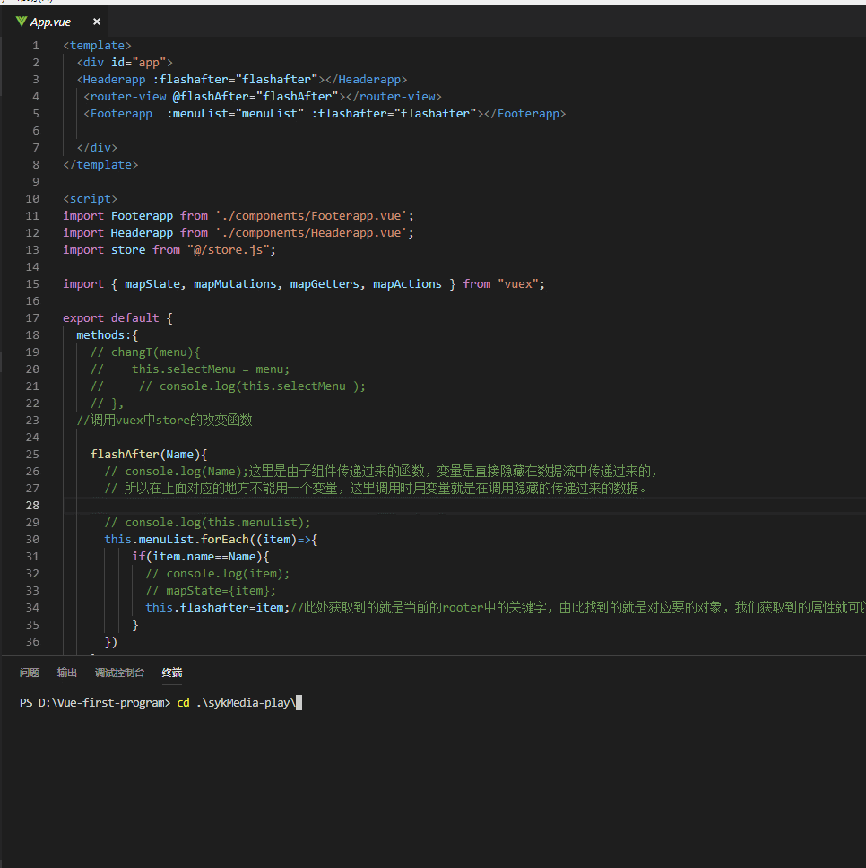

# sykMedia-player

## 项目的背景
    鉴于我本人学习vue-cli，所以我决定做一个小项目练练手，技能考研我的动手能力，也能磨炼我的业务逻辑思考能力
    我觉得很有必要。而很早就有对音乐播放器的实现原理的好奇，所以我就决定简单实现一下我心中的所想的原理，就尝试用vue-cli
    做一个播放器吧，顺便也做了一下电影列表，也刚好为自己的微信小程序练练手，听说二者数据绑定很像哦。

## 项目的实现的具体功能
    1.热门电影列表查询获取
    2.音乐播放器的模拟
    3.轮播图组件测试与使用
    4.相册浏览器模拟

## 项目的技术详情
    1.vue.js
    3.axios
    4.vue声明周期以及钩子函数使用
    5.js异步方法“定时器”模拟歌词与歌曲的动态对应（较为复杂，纯原生模拟）
    6.vue-touch,vue-swipe
    7.正则表达式
    8.点透事件的解决

## 项目的详情展示
#### 启动

#### 电影列表

#### 音乐播放

#### 图片浏览器
##### （相关的图片引用均不用于商业用途，如遇到侵犯版权问题，请联系本git账号！！！，本人立马整改）

#### swiper轮播图

